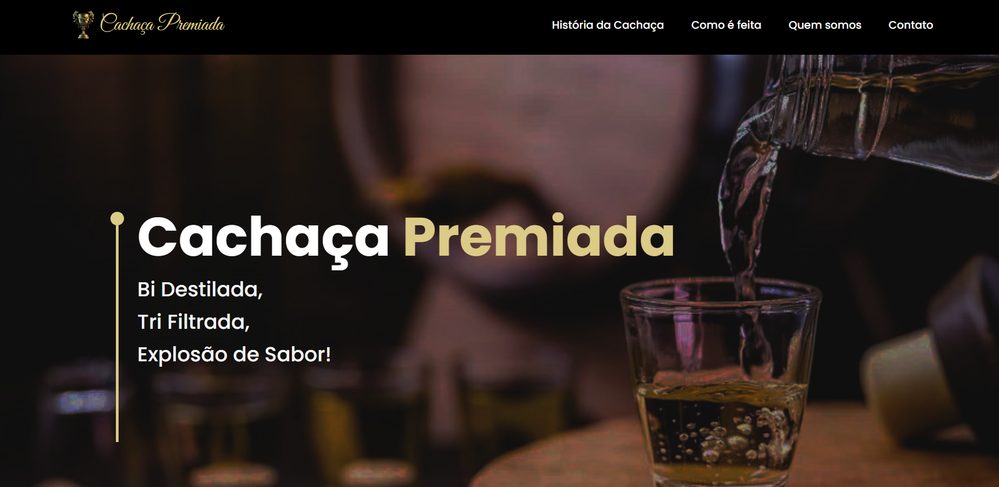
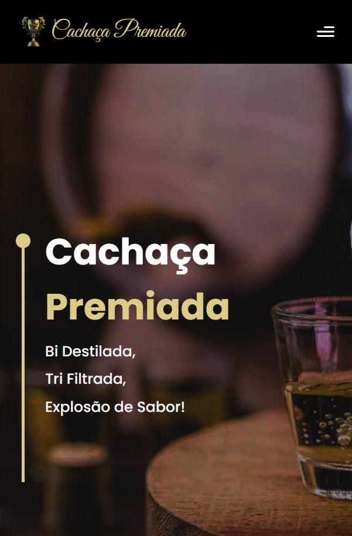
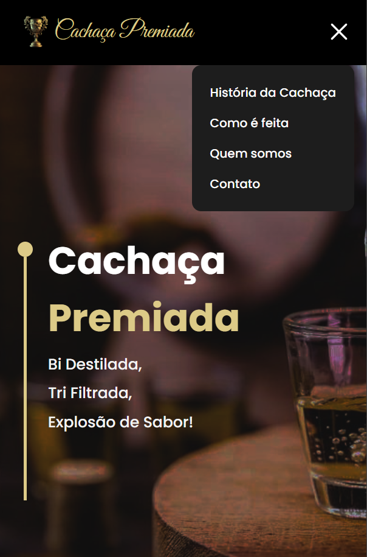

<h1 align="center"> UI GPT-3</h1>

## 💻 Projeto
Landing page desenvolvida para atender a Cachaça Premiada.

Para acessar o projeto [Clique Aqui!](https://premiada.netlify.app/)

    
    
     
  

## 🚀 Tecnologias Utilizadas
Esse projeto foi desenvolvido com as seguintes tecnologias: 
HTML  
CSS  
Tailwindcss 
JavaScript 
ReactJs 
React Router Dom 
React Icons 
React Vertical Timeline 
Emailjs 
Framer Motion

                                              
